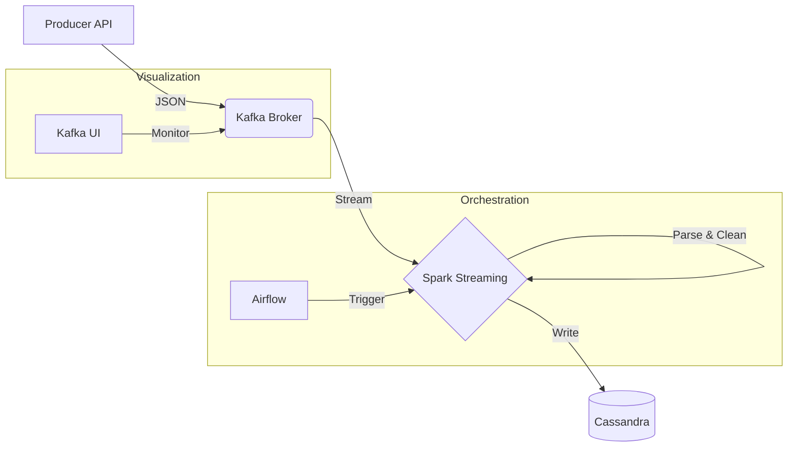

# Data Engineering End-to-End Pipeline

A comprehensive real-time data engineering pipeline that ingests, processes, and stores user data using modern technologies.

## Architecture



## Tech Stack

-   **Source**: Random User API (Python Producer)
-   **Message Broker**: Apache Kafka (Confluent)
-   **Processing**: Apache Spark Structured Streaming
-   **Storage**: Apache Cassandra
-   **Orchestration**: Apache Airflow
-   **Containerization**: Docker & Docker Compose

## Prerequisites

-   Docker Desktop (with 8GB+ RAM recommended)
-   Python 3.9+ (for local development)

## Getting Started

### 1. Start Services
Run the following command to build and start all containers:

```bash
docker compose up -d --build
```

Wait a few minutes for all services (Kafka, Cassandra, Airflow, Spark) to initialize.

### 2. Initialize Database
Create the Cassandra keyspace and table:

```bash
docker compose cp spark/init_cassandra.cql cassandra:/init_cassandra.cql
docker compose exec cassandra cqlsh -f /init_cassandra.cql
```

### 3. Submit Spark Job
Submit the streaming job to the Spark cluster:

```bash
docker compose cp spark/spark_stream.py spark-master:/opt/bitnami/spark/spark_stream.py
docker compose exec spark-master spark-submit \
  --master spark://spark-master:7077 \
  --packages com.datastax.spark:spark-cassandra-connector_2.12:3.4.1,org.apache.spark:spark-sql-kafka-0-10_2.12:3.4.1 \
  /opt/bitnami/spark/spark_stream.py
```

## Monitoring

-   **Airflow UI**: [http://localhost:8082](http://localhost:8082) (User/Pass: `admin`/`admin`)
-   **Kafka UI**: [http://localhost:8080](http://localhost:8080)
-   **Spark Master**: [http://localhost:8081](http://localhost:8081)

## Verification

 Check if data is landing in Cassandra:

```bash
docker compose exec cassandra cqlsh -e "SELECT count(*) FROM spark_streams.created_users;"
```

You should see the count increasing over time!
